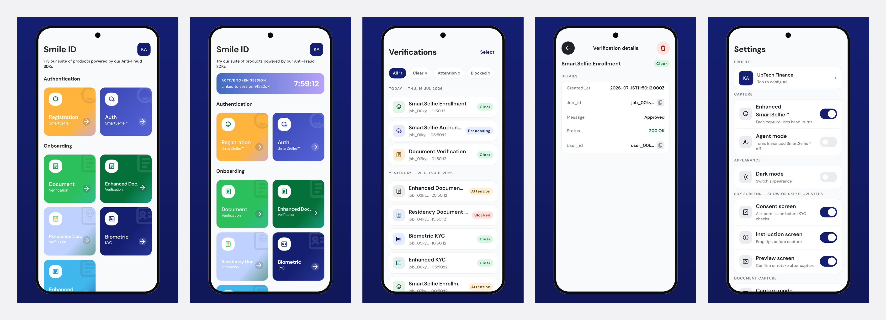

# Smile ID sample apps (v12)

Four sample apps (Android, iOS, Flutter and React Native with Expo) that integrate the
[Smile ID](https://smileid.com) v12 SDKs **exactly the way a partner does**. Every app resolves its SDK
from the public registry (Maven Central, Swift Package Manager, pub.dev, npm), never from a local
checkout.

That constraint is the point. It makes these apps both the reference integration partners copy and a
test of what we publish: a defect that exists only in the published SDK, such as a missing dependency,
a file absent from the package, or a keep rule that fails only under minification, shows up here first.

## Try the apps

The Android and iOS apps are on Google Play and the App Store as **Smile ID**.

<a href="https://apps.apple.com/app/id6811672322"></a>
<a href="https://play.google.com/store/apps/details?id=com.usesmileid.sample.android"></a>



## What each app shows

- **Every v12 product**: SmartSelfie™ Enrollment and Authentication, Biometric KYC, Document
  Verification, Enhanced Document Verification, Residency Document Verification and Enhanced KYC,
  each composed with the flow builder.
- **Token sessions**: link the app to a real account by scanning or pasting a v3 token, with no API key
  in the app. When the token already carries the user's details and consent, the app skips those steps.
- **Verifications**: every submitted job, stored on the device, with its status refreshed from
  `GET /v3/status`.
- **Profiles** for different partners or test users, and **dark mode** carried through to the SDK's
  screens.
- **Probes** for automation and debugging: a scenario drawer, an on-screen result card and callback
  counters.

Runs go to the Smile ID **sandbox** unless a linked token names production. **Simulate a successful
scan** on the scan sheet reaches every screen without a real token.

## App size

Adding Smile ID makes an app this much bigger to download, for SDK 12.2.0:

| Your app is built with | Selfie only | Selfie and documents |
|---|---|---|
| Android (Kotlin) | +2.9 MB | +9.9 MB |
| iOS (Swift) | +4.3 MB | +4.3 MB |
| Flutter, on Android | +3.6 MB | +11.0 MB |
| Flutter, on iOS | +3.2 MB | +3.6 MB |
| React Native (Expo), on Android | +8.1 MB | +15.2 MB |
| React Native (Expo), on iOS | +8.6 MB | +8.7 MB |

"Selfie only" covers SmartSelfie™ and Biometric KYC. "Selfie and documents" adds document capture,
which every document product needs.

### What the numbers mean

- **Download** is what a user's phone downloads from the store, compressed.
- **On device** is the space the app takes once installed, which is always larger.

Each SDK measures these against its platform's new, empty project, then adds Smile ID's packages. The
difference is what Smile ID costs your app. The full figures, both measures:

| Platform | What you add | Download | On device |
|---|---|---|---|
| Android | Starting point: a new Android Studio project | 0.65 MB | 1.33 MB |
| Android | Selfie (`usesmileid` + `usesmileid-mlkit-face`) | +2.85 MB | +5.43 MB |
| Android | Selfie and documents (+ `usesmileid-mlkit-document`) | +9.87 MB | +20.17 MB |
| iOS | Starting point: a new Xcode project | 0.01 MB | 0.08 MB |
| iOS | Selfie (`UseSmileID` + `UseSmileIDVisionFace`) | +4.29 MB | +10.30 MB |
| iOS | Selfie and documents (+ `UseSmileIDVisionDocument`) | +4.31 MB | +10.41 MB |
| Flutter, Android | Starting point: a new `flutter create` project | 7.16 MB | 15.54 MB |
| Flutter, Android | Selfie | +3.57 MB | +8.06 MB |
| Flutter, Android | Selfie and documents | +10.98 MB | +23.79 MB |
| Flutter, iOS | Starting point: a new `flutter create` project | 6.05 MB | 14.16 MB |
| Flutter, iOS | Selfie | +3.20 MB | +8.89 MB |
| Flutter, iOS | Selfie and documents | +3.55 MB | +9.81 MB |
| Expo, Android | Starting point: a new `create-expo-app` project | 9.39 MB | 24.62 MB |
| Expo, Android | Selfie | +8.05 MB | +22.68 MB |
| Expo, Android | Selfie and documents | +15.16 MB | +37.93 MB |
| Expo, iOS | Starting point: a new `create-expo-app` project | 8.20 MB | 27.73 MB |
| Expo, iOS | Selfie | +8.64 MB | +22.53 MB |
| Expo, iOS | Selfie and documents | +8.67 MB | +22.70 MB |

### A complete app, for comparison

These apps are a complete integration: every product, selfie and document capture, and their own
screens, fonts and token scanner. That is the most an app adds.

| App | Download | On device |
|---|---|---|
| Android, version 1.0.3 | 14.29 MB | 29.38 MB |
| iOS, on SDK 12.2.0 | 5.48 MB | 13.62 MB |

### Why the numbers differ

- **Document capture on Android carries a model.** ML Kit's document detection ships inside the app,
  which is most of that column. ML Kit's face model downloads separately through Google Play services,
  so it is not counted.
- **iOS needs no model.** Apple's Vision framework is part of iOS, so documents add almost nothing
  over selfie.
- **React Native brings its own peers.** Much of each Expo row is packages the SDK needs alongside it,
  such as Lottie. An app that already ships them pays less.
- **You never pay twice.** An app that already uses Compose, CameraX or the same peers pays less than
  these figures. Add only what you use: a selfie-only app needs no document package.

### How it is measured

[`scripts/app_size.py`](scripts/app_size.py) measures these apps the way the SDKs measure theirs.
Android is bundletool's figure for an arm64 phone on Android 14 at 480 dpi, which is what Google Play
delivers to that phone. iOS is the release build's size on disk, with a zip of it standing in for the
App Store's compressed download. The apps were measured on 1 October 2026, and the release check
reports the Android figure on every run.

## Run an app

### Prerequisites

| Platform | Needs |
|---|---|
| Android | JDK 21 or newer, and an Android SDK with API 37 |
| iOS | Xcode 26, and [XcodeGen](https://github.com/yonaskolb/XcodeGen) |
| Flutter | The Flutter stable channel |
| Expo | Node 20.19 or newer, and pnpm 9 |

### Android

```bash
cd android
./gradlew installDebug
adb shell am start -a android.intent.action.VIEW -d "usesmileid-sample-android://products"
```

### iOS

```bash
cd ios/App && xcodegen generate && open UseSmileIDSample.xcodeproj
```

The Xcode project is generated from `ios/App/project.yml` and is not committed. In debug builds, shake
the device to read the app's own network traffic, with credentials redacted.

### Flutter

```bash
cd flutter/app && flutter run
```

### Expo

```bash
cd expo && pnpm install
cd app && pnpm prebuild && pnpm android    # or: pnpm ios
```

The Expo app needs `react-native-worklets/plugin` as the **last** Babel plugin
(`expo/app/babel.config.js`), or capture does not run.

### Deep links

Every route in `spec/routes.json` opens by deep link on each app's URL scheme:
`usesmileid-sample-android://`, `usesmileid-sample-ios://`, `usesmileid-sample-flutter://` and
`usesmileid-sample-expo://`.

## Check a change

Each platform has one script that is its definition of done, and CI runs the same script on every pull
request:

```bash
android/verify.sh
ios/verify.sh
flutter/verify.sh
expo/verify.sh
```

## Guides

| Guide | Answers |
|---|---|
| [Architecture](docs/architecture.md) | How the four apps are built and kept identical, and where the SDK is called |
| [Token sessions](docs/token-session.md) | How to run verifications from a v3 token instead of an API key |
| [Theming](docs/theming.md) | How the apps theme themselves and the SDK |
| [Testing](docs/testing.md) | How to test an integration like this one |
| [Submitting to the stores](docs/store-submission.md) | What the SDK means for your App Store and Google Play submission |
| [Releasing](docs/releasing.md) | How these apps reach the stores |
| [Backlog](docs/plan/backlog.md) | Known gaps, if you want to contribute |

The SDK reference is at [docs.smileidentity.com](https://docs.smileidentity.com).

## Layout

| Path | What lives there |
|---|---|
| `spec/` | The cross-app contract as data: scenarios, routes, launch arguments, result-card fields, test ids, design tokens |
| `android/` | The Android app (`app/`) and its `sample-ui` library |
| `ios/` | The iOS app (`App/`) and the `SampleUI` Swift package |
| `flutter/` | The Flutter app (`app/`) and the `sample_ui` package |
| `expo/` | The Expo app (`app/`) and the `sample-ui` TypeScript package |

Each platform splits into a thin **app shell** (the SDK dependency, native configuration and flow host)
and a **`sample-ui` library** holding every screen a partner sees. [`AGENTS.md`](AGENTS.md) is the full
contributor guide, for people and coding agents alike.

## Contributing and security

See [CONTRIBUTING.md](CONTRIBUTING.md). Report security problems privately, as
[SECURITY.md](SECURITY.md) describes, never in a public issue. Never commit a token, partner id or API
key.

## Licence

The code is MIT-licensed ([LICENSE](LICENSE)). Bundled fonts, icons and Smile ID marks keep their own
terms ([NOTICE](NOTICE)).
